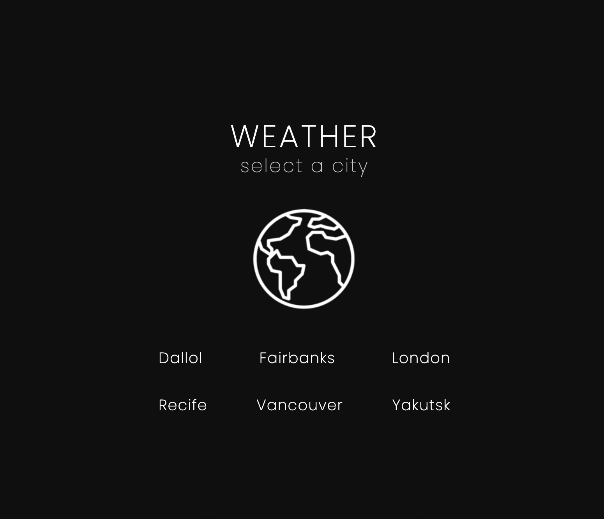

# Project Weather App

Projeto que simula um app de previsão do tempo.

- Foi utilizada a API do [weatherApi](https://weatherapi.com/).
- Foi desenvolvido com `reactjs` e `styled-components`.

Home page
:-------------------------:|
 |

---

React Testing Library coverage
:-------------------------:|
 |

---

## Instalação do projeto localmente:

1. Abra o terminal e crie um diretório no local de sua preferência com o comando **mkdir**:

```javascript
  mkdir weather-app
```

2. Entre no diretório que acabou de criar e depois clone o projeto:

```javascript
  cd weather-app
  git clone git@github.com:thiagolvr/weather-project.git
```

3. Acesse o diretório do projeto e depois utilize o comando **npm install** para instalar todas as dependências necessárias:

```javascript
  cd weather-project
  npm install
```

4. Inicialize a aplicação localmente com comando **npm start** e acesse o endereço **http://localhost:3000**:

```javascript
  npm start
```

⚠ Atenção ⚠ O uso de extensões do tipo dark mode pode comprometer a fidelidade das cores da aplicação e dos seus ícones.
<br> Recomenda-se desativar a extensão para uma melhor experiência.

<details>
  <summary>
    <strong>💡 Deploy</strong>
  </summary><br>

- Foi utilizado o serviço Netlify para fazer o deploy da aplicação.
- A aplicação está disponível no endereço: https://weather-app-thiagolvr.netlify.app/
</details>

<details>
  <summary>
    <strong>🐳 Rodando no Docker vs Localmente</strong>
  </summary><br>

## Docker

> Rode o serviço `node` com o comando `docker compose up -d`.

```javascript
  docker compose up -d
```

- Esse serviço irá inicializar um container chamado `weather-app`.
- A partir daqui você pode rodar o container `weather-app` via CLI ou via um editor de código de sua preferência. Ex: VSCode.
- Lembre-se de verificar se a sua porta 3000 não está ocupada.
- A aplicação estará disponível em `http://localhost:3000`.
- A flag `-d` roda o container em segundo plano.
- Para parar o container, utilize o comando `docker compose down`.

> Use o comando `docker container exec -it weather-app sh`.

```javascript
  docker container exec -it weather-app sh
```

- Ele te dará acesso ao terminal interativo do container criado pelo compose, que está rodando em segundo plano.
- Você poderá usar esse terminal para executar os comandos do npm (`npm start`, `npm test` ...)

> As dependências já foram instaladas durante o processo com o comando `docker compose up -d`.

⚠ Atenção ⚠ Caso opte por utilizar o Docker, **TODOS** os comandos disponíveis no `package.json` (`npm start`, `npm test`, ...) devem ser executados **DENTRO** do container, ou seja, no terminal que aparece após a execução do comando `docker container exec` citado acima.

## Localmente

> Instale as dependências com `npm install`

```javascript
  npm install
```

- Para rodar localmente, é preciso ter o node instalado na sua máquina.
- A versão local do seu node precisa ser a 16.

⚠ Atenção ⚠ Não rode o comando npm audit fix! Ele atualiza várias dependências do projeto, e essa atualização pode quebrar a aplicação.

</details>

<details>
  <summary>
    <strong>🛠 Testes</strong>
  </summary><br>

- Para executar os testes localmente, digite no terminal o comando `npm test`.

```javascript
  npm test
```

- Para executar os testes no Docker, digite no terminal o comando `docker container exec -it weather-app sh` para entrar no terminal interativo do container.

```javascript
  docker container exec -it weather-app sh
```

- Digite o comando `npm test` para executar os testes.

```javascript
  npm test
```

<details>
  <summary>
    <strong>🛠 Cobertura dos Testes</strong>
  </summary><br>

- Para executar a cobertura dos testes localmente, digite no terminal o comando `npm run test-coverage`.

```javascript
  npm run test-coverage
```

- Para executar a cobertura dos testes no Docker, digite no terminal o comando `docker container exec -it weather-app sh` para entrar no terminal interativo do container.

```javascript
  docker container exec -it weather-app sh
```

- Digite o comando `npm run test-coverage` para executar a cobertura dos testes.

```javascript
  npm run test-coverage
```

</details>

## Referências

[Documentação Oficial - Docker](https://docs.docker.com)<br>
[Documentação Oficial - React Hooks](https://react-redux.js.org/api/hooks)<br>
[Documentação Oficial - Styled Components](https://styled-components.com/docs)<br>
[Conventional Commits](https://www.conventionalcommits.org/en/v1.0.0/)<br>
